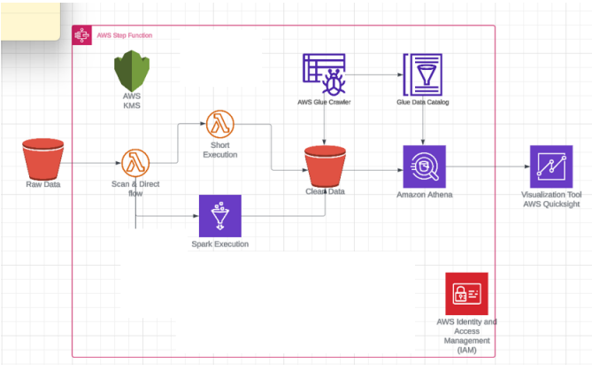

Dự án này được thực hiện trên AWS với các bước:

Bước 1: Tải dữ liệu lên AWS S3

Bước 2: Lambda trigger được kích hoạt khi ta thêm file. Một hàm lambda sẽ chạy và phân chia
dữ liệu về hai luồng. Nếu kích thước dữ liệu lớn hơn 20MB thì sẽ để Glue xử lý còn với trường hợp nhỏ hơn 20MB thì sẽ để một hàm Lambda xử lý dữ liệu.

Bước 3: Sau khi xử lý dữ liệu thì lưu vào một thư mục riêng khác trong S3.

Bước 4: Sau đó sử dụng Glue Crawler đẩy dữ liệu lên Athena.

Bước 5: Cuối cùng sử dụng QuickSight để vẽ các biểu đồ để minh hoạ dữ liệu.